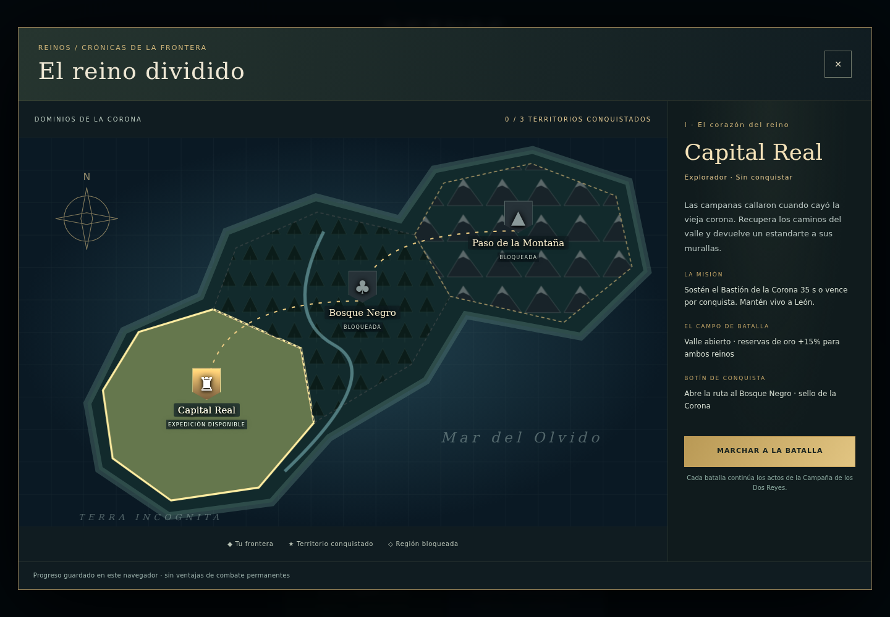
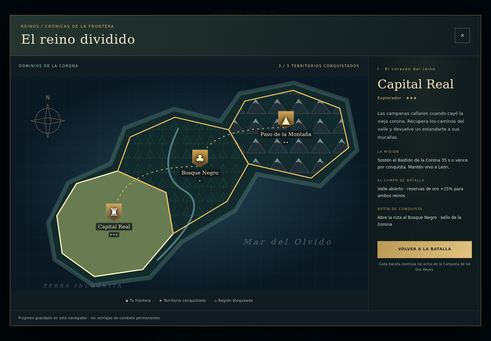
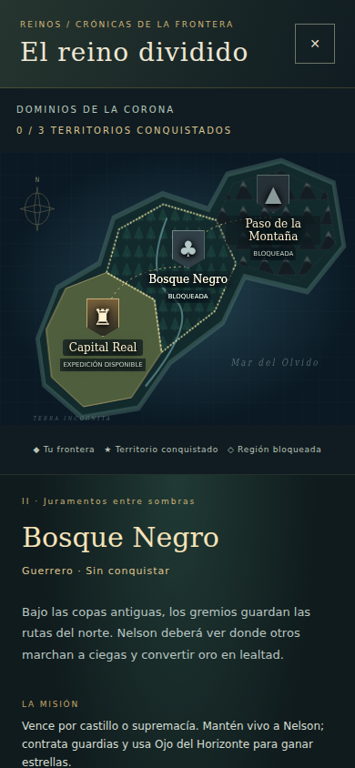

# Primera frontera · notas para revisión

La nueva entrada del menú abre un atlas SVG con tres territorios conectados.
Capital Real utiliza el acto I y un valle con +15% de reservas de oro; Bosque
Negro utiliza el acto II, reduce visión un 15% y aumenta madera por árbol un
50%; Paso utiliza el acto III, laderas lentas, +30% oro y −20% madera. Los
modificadores afectan a ambos bandos. No hay ventajas persistentes de combate.

El catálogo `world.js` contiene IDs, requisitos, coordenadas, territorios,
briefings y reglas. El motor recibe una región validada solo al iniciar una
campaña; el atlas gestiona un guardado independiente `reinos.world.v1`.
Victorias regionales conservan el avance del acto clásico. La campaña antigua
no desbloquea el atlas automáticamente. Perder, reproducir o importar una
repetición no otorga regiones; las estrellas conservan su máximo.

`game.js` mantiene el motor; las nuevas pantallas, estilos y progresión están
fuera de él. Se añadieron puntos acotados para terreno, recursos, visión,
metadatos y desenlaces. Los comandos y el transporte P2P no cambian.

Se corrigieron tres problemas relacionados con replay: acceso léxico a `Net`
para validar/grabar órdenes, reconstrucción de estrellas antes del checksum y
limpieza de la batalla activa en Crónica al reproducir. Reiniciar reutiliza el
AudioContext. Motor/cache pasan a `reinos-world-v9`; replays previos permanecen
exportables y marcados incompatibles, sin migración ficticia.

## Evidencia

## Validación local

- Instalación reproducible con `npm ci`; sintaxis de todos los JS/MJS.
- `npm test`: contratos existentes, checksum y progresión/sanitización.
- Motor original en navegador: `fbe1b83b` dos veces; otra semilla `3549e6dc`.
- E2E real Chromium: bloqueo, derrota, reintento, tres victorias, recarga,
  órdenes presentes en replay, checksum final, ausencia de recompensas/crónica
  duplicadas, regiones importadas inválidas, campaña clásica, JSON corrupto,
  almacenamiento denegado/cuota y fallback en memoria, touch 390×844 y PWA offline.
- Cada región, 360 ticks con semilla 1234 repetida y 1235 distinta:

| Región | Misma semilla, dos ejecuciones | Semilla distinta |
| --- | --- | --- |
| Capital | `4792cd34` | `6985de73` |
| Bosque | `1ec7c874` | `54a73bd1` |
| Paso | `96ee952f` | `f13c9954` |

Las victorias E2E preparan propiedad de Bastiones mediante instrumentación
exclusiva del servidor de prueba. El motor ejecuta captura, timers, desenlace,
puntuación y replay; no se falsifica el evento de recompensa. Son pruebas de
integración reproducibles, no una evaluación del balance jugando tres misiones
completas manualmente. Las capturas de conquista utilizan esos guardados de prueba.

Muestra de 119 intervalos de frame, una partida activa en Chromium headless:
mediana **33,3 ms**, p95 **50 ms**. No demuestra 60 FPS, ni rendimiento móvil
real ni partidas de 160 unidades. El atlas no añade trabajo por tick/frame;
perfilar el motor y HUD sigue siendo trabajo pendiente.

## Límites deliberados

- Tres variantes regionales sobre los actos, dimensiones y posiciones de
  castillos/Bastiones existentes; no terreno topológico completamente nuevo.
- Las montañas son suelo lento, no muros infranqueables; el pathfinding actual
  conserva los riesgos identificados en la auditoría.
- Sellos y estrellas se representan en el atlas; no inventario de skins,
  comandantes desbloqueables ni árbol de metapoderes en esta fase.
- Guardado local sin cuenta ni sincronización entre dispositivos. Borrar datos
  del navegador borra esta progresión; fallo de escritura se avisa al jugador.
- Conserva IA/dificultades y HUD existentes; no certifica balance o PvP entre
  redes reales. Lobby, reconexión y optimización quedan en el gameplan.
- Sin merge automático ni despliegue.
